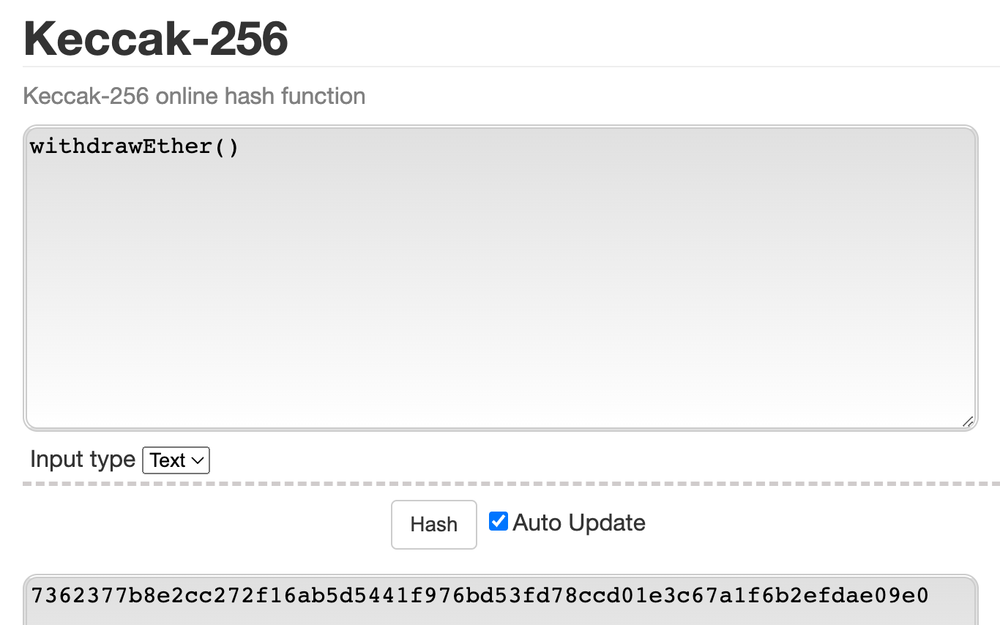

Let's define all of the transaction fields present above:

    nonce: index, gets incremented every time transaction gets mined
    recipient: the receiving address (if an externally-owned account, the transaction will transfer value. If a contract account, the transaction will execute the contract code)
    value: amount of ETH to transfer from sender to recipient (in WEI, a denomination of ETH)
    yParity, r, s (aka: digital signature): signature components
    init or data: typically referred to as “calldata”, 0 if just a typical ETH transfer
    gasLimit: maximum amount of gas units that can be consumed
    type: type 0 for legacy (pre-EIP-1559) or type 2 for EIP-1559-compatible txs
    maxPriorityFeePerGas (aka: minerTip): the maximum amount of gas to be included as a tip to the validator
    maxFeePerGas: the maximum amount of gas willing to be paid for the transaction (inclusive of baseFeePerGas and maxPriorityFeePerGas)
    chainId: in order to protect against replay attacks on other EVM chains, each transaction must now include a specific id per chain. Mainnet is 0. Göerli is 5. You can check other chain ids here: https://chainlist.org/


## Transaction Object Example

Alice sends Bob 1 ETH
```
{
  to: "0x2c8645BFE28BEEb6E19843eE9573b7539DD5B530", // Bob
  gasLimit: "21000",
  maxFeePerGas: "30", // 28 (base) + 2 (priorityFee)
  maxPriorityFeePerGas: "2", // minerTip
  nonce: "0",
  value: "100000000000000000", // 1 ether worth of wei
  data: '0x', // no data, we are not interacting with a contract
  type: 2, // this is not a legacy tx
  chainId: 4, // this is AU, we deal only in test networks! (Göerli)    
}
```

Alice calls a function on a smart contract
```
{
  to: "0xEA674fdDe714fd979de3EdF0F56AA9716B898ec8", // smart contract address
  gasLimit: "36000",
  maxFeePerGas: "30", // 28 (base) + 2 (priorityFee)
  maxPriorityFeePerGas: "2", // minerTip
  nonce: "1", // this is Alice's second transaction, so the nonce has increased!
  value: "100000000000000000", // 1 ether worth of wei
  data: '0x7362377b0000000000000000000000000000000000000000000000000000000000000000', // this calldata tells the EVM what function to execute on the contract, contains parameter values here as well
  type: 2, // this is not a legacy tx
  chainId: 4, // this is AU, we deal only in test networks! (Göerli)    
}
```

## How To Manually Construct Calldata

Once we send a transaction that points to a smart contract, how does the contract know what specific function you intend to call? Well, all those specifics end up going in the data field of each transaction.

Here is the algorithm to manually construct calldata:

1.  Say Alice wants to call the withdrawEther() function of a faucet smart contract...

2.  Alice must take the keccak256 hash of that function signature:


The resulting output is: `7362377b8e2cc272f16ab5d5441f976bd53fd78ccd01e3c67a1f6b2efdae09e0`

3. Take the first 4 bytes (8 characters) of the hash output, which is just: 7362377b

4. This function takes no arguments, so no need to append any parameter data.
>If the function took arguments, you would need to hash the entire function signature with that parameter type, for example: helloWorld(uint256)

5. Final calldata construction, padded out to 32 bytes: `0x7362377b0000000000000000000000000000000000000000000000000000000000000000`


